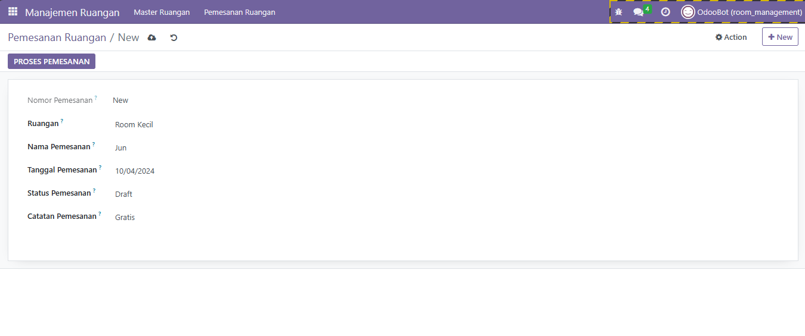

# Manajemen Ruangan - Odoo Module

**Version**: 1.0
**Author**: Junizar Fajri

## Summary

Modul **Manajemen Ruangan** digunakan untuk manajemen ruangan dan pemesanan ruangan di Odoo. Modul ini memungkinkan pengguna untuk menambahkan ruangan baru, melihat daftar ruangan yang tersedia, dan mengelola pemesanan ruangan. Fitur termasuk kemampuan untuk mengupdate status pemesanan dari "Draft" menjadi "On Going" dan dari "On Going" menjadi "Done."

## Features

- **Manajemen Ruangan**: Tambah, edit, dan hapus ruangan.
- **Pemesanan Ruangan**: Tambah pemesanan baru, kelola status pemesanan, dan pastikan tidak ada pemesanan ganda pada tanggal yang sama.
- **Proses Pemesanan**: Tersedia tombol untuk memperbarui status pemesanan dari "Draft" ke "On Going" hingga "Done."
- **Tampilan Grid dan List**: Visualisasi ruangan dalam bentuk Kanban (grid) dan List (daftar).

## Installation

### Prerequisites

- Odoo 16 atau versi yang kompatibel.
- Akses ke Odoo dengan hak istimewa administrator untuk menginstal modul.

### Steps

1. **Download Module**
   Unduh modul **Manajemen Ruangan** ini dan letakkan di direktori `addons` atau `custom_addons`, sesuaikan dengan configurasi Odoo Anda.
2. **Install Module**
   Masuk ke Odoo sebagai administrator dan navigasikan ke:

   ```
   Apps > Update Apps List > Manajemen Ruangan > Install
   ```

3. **Dependencies**
   Modul ini memiliki dependensi pada modul 'base' yang otomatis akan diinstal jika belum ada.

## Usage

### 1. Manajemen Ruangan

- Akses menu **Manajemen Ruangan > Master Ruangan**.
- Di sini, Anda dapat menambah, melihat, dan mengedit data ruangan.
- Tampilan ruangan bisa dilihat dalam bentuk **Kanban (Grid)** atau **List**.

### 2. Pemesanan Ruangan

- Akses menu **Manajemen Ruangan > Pemesanan Ruangan**.
- Tambahkan pemesanan baru dengan memilih ruangan, tanggal, dan nama pemesan.
- Gunakan tombol **Proses Pemesanan** pada form pemesanan untuk memperbarui status dari **Draft** menjadi **On Going** dan kemudian ke **Done**.

### 3. Validasi Double Booking

- Pemesanan ruangan pada tanggal yang sama dengan ruangan yang telah dipesan akan menghasilkan error validasi, sehingga tidak ada pemesanan ganda pada hari yang sama.

## Screenshots

1. **Master Ruangan List View**
   
2. **Master Ruangan Kanban View**
3. **Pemesanan Ruangan Form**
   
4. **Pemesanan Ruangan Form**
   
5. **Pemesanan Ruangan Form**
   
6. **Pemesanan Ruangan Form**
   

## Troubleshooting

Jika terjadi masalah, pastikan Anda sudah memperbarui daftar aplikasi dan memeriksa kembali dependensi yang dibutuhkan.

## Support

Untuk bantuan atau masalah, hubungi kami di [jun.fajr@gmail.com](mailto:jun.fajr@gmail.com).
